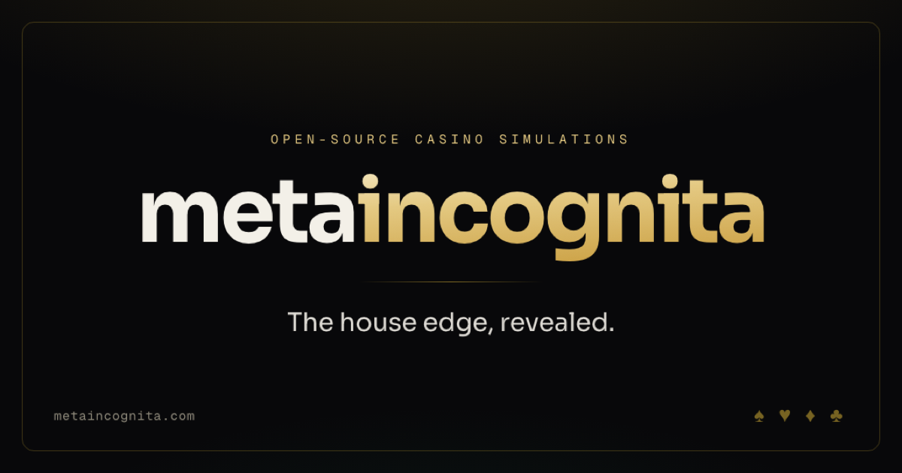

# metaincognita

[](LICENSE)
&nbsp;
&nbsp;
&nbsp;
&nbsp;
&nbsp;[](https://metaincognita.com)



The landing page for **metaincognita** — a collection of casino games rebuilt as
honest, open-source **simulations** that expose the math the floor never shows, plus a
growing set of **tools** for a sharper mind.

> **Not a gambling site.** No real money, no accounts, no logins, no AI — just
> simulations you run in your browser. Everything is open source and free to fork.

**Live:** https://metaincognita.com

This repository is *only* the landing page. Each project below is its own deployment and
its own repository under [`github.com/cschweda`](https://github.com/cschweda); the page
simply links out to them.

## The collection

### Simulations — casino games

| Simulation | Live | What it is |
| --- | --- | --- |
| Blackjack Trainer | `blackjack.metaincognita.com` | Basic-strategy coaching and Hi-Lo card counting on official-rulebook rules. |
| No-Limit Hold’em | `holdem.metaincognita.com` | Texas Hold’em vs. intelligent bots, with live equity, outs, pot odds and ranges. |
| Roulette Trainer | `roulette.metaincognita.com` | A real forward-physics wheel, proven fair by simulation. |
| Slots Simulator | `slots.metaincognita.com` | Reel strips, virtual-reel weights and exact house edge across eight archetypes. |
| Craps Simulator | `craps.metaincognita.com` | Learn the line, the odds bets and where the edge hides. |
| Video Poker Trainer | `videopoker.metaincognita.com` | Optimal play, pay-table literacy and bankroll management. |
| Flameout | `flameout.metaincognita.com` | A crash-game simulator: climb, cash out, then see why the house always wins. |
| Pachinko Parlor | `pachinko.metaincognita.com` | Ball-drop physics and payout pockets, with the odds laid bare. |

### Tooling

| Tool | Live | What it is |
| --- | --- | --- |
| PAO Speed Trainer | `pao.metaincognita.com` | Drill the Person–Action–Object system across all 52 cards until each triplet fires as one reflex. |

## Tech stack

- **[Nuxt 4](https://nuxt.com)** with the `app/` directory structure, prerendered to static HTML (SSG)
- **[Nuxt UI 4](https://ui.nuxt.com)** + **Tailwind CSS v4**
- Self-hosted fonts via `@nuxt/fonts` — **Sora** (geometric, infographic-style display + body) and **Geist Mono** (technical labels)
- Lucide icons (`@iconify-json/lucide`, bundled at build — no runtime Iconify calls)
- [Plausible](https://plausible.io) analytics (`@nuxtjs/plausible`)
- **pnpm** · **Node 22**

## Floor audio

The landing page can play an ambient casino loop. **It is off on every page load,
without exception, and nothing is remembered.** A landing page does not get to make
noise at someone who never asked for it.

Sound is turned on only by the switch in the status bar. Reload, revisit, or come back
tomorrow and you are back to silence. There is deliberately **no persisted preference**:
if we stored an "on" choice, a reload would leave the switch reading *on* over a silent
page (browsers won't start audio without a gesture), and one stray click would bring the
noise back unannounced. Nothing stored means nothing to be surprised by.

Nothing is downloaded until the switch is actually flipped — `preload="none"`, and the
`<audio>` element isn't even constructed until then — so first paint is byte-for-byte
identical whether a visitor ever turns sound on or not.

`play()` is never called outside a user-gesture handler. Browsers reject audible autoplay
anyway, but it is also a WCAG 1.4.2 (Audio Control) failure and a dark pattern besides.
The switch **is** the gesture.

The equaliser bars on the switch read from whether the floor is *actually audible*, not
from the setting — so the control can never claim to be playing over a silent page.

**Shipped assets** (in `public/audio/`):

| File | Codec | Size |
|---|---|---|
| `casino-floor.webm` | Opus 40k stereo | 451 KB |
| `casino-floor.m4a` | AAC 48k mono | 563 KB |

Both are a seamless 93.944s loop.

### Regenerating them

The raw source is a freesound_community upload via Pixabay
(Pixabay Content License — commercial use, no attribution required; credited here
anyway). It is 98s, stereo, 24 kHz, 160 kbps, and has a **mean volume of −32.5 dB
with peaks at 0.0 dB** — a quiet crowd bed with full-scale transients buried in it.
Untreated it is either inaudible or it spikes, so it must be compressed before it can
work as a background loop.

Normalise **first**, then loop, so the crossfade blends already-levelled audio:

```bash
SRC=audio/freesound_community-bruit-2-casino-56939.mp3

# 1. high-pass the sub-60Hz rumble, compress, normalise → mean −21.8 dB, peak −1.2 dB
ffmpeg -i "$SRC" -af "highpass=f=60,loudnorm=I=-18:TP=-1.5:LRA=7" -ar 24000 -ac 2 norm.wav

# 2. seamless loop: crossfade the tail into the head. D=97.944, X=4 → L=93.944
ffmpeg -i norm.wav -filter_complex "\
[0:a]atrim=0:4,asetpts=N/SR/TB[head];\
[0:a]atrim=4:93.944,asetpts=N/SR/TB[body];\
[0:a]atrim=93.944:97.944,asetpts=N/SR/TB[tail];\
[tail][head]acrossfade=d=4:c1=tri:c2=tri[xf];\
[xf][body]concat=n=2:v=0:a=1[out]" -map "[out]" -ar 24000 -ac 2 loop.wav

# 3. encode
ffmpeg -i loop.wav -c:a libopus -b:a 40k -vbr on -application audio -ac 2 \
  public/audio/casino-floor.webm
ffmpeg -i loop.wav -c:a aac -b:a 48k -ac 1 -ar 24000 -movflags +faststart \
  public/audio/casino-floor.m4a
```

### Credits

Ambient casino beds by the **freesound_community** on
[Pixabay](https://pixabay.com/sound-effects/).

## Project structure

```
app/
  app.vue              # UApp wrapper + global backdrop + grain + status bar
  app.config.ts        # Nuxt UI theme (gold primary, warm neutrals)
  assets/css/main.css  # design tokens, palette, grain, reveal animations
  components/
    GameCabinet.vue    # the neon game cabinet (chasing bulb, glow, badge)
    CabinetArt.vue     # bespoke line-art scenes for the roomy cabinets, accent-tinted
    TheBackdrop.vue    # magenta/cyan/violet room glow, drifting suit glyphs
    TheHero.vue        # wordmark, tagline, CTAs, "not gambling" chips
    TheStatusBar.vue   # fixed open-source / GitHub status bar + audio switch
    SoundSwitch.vue    # the floor-audio toggle, used inside TheStatusBar
    TheTicker.vue      # the LED marquee
    TheFooter.vue
    ZoneSign.vue       # the neon zone sign
  composables/
    useFloorAudio.ts   # audio preference + playback control
  data/catalog.ts      # zone-shaped data (zones, allItems)
  utils/
    jsonLd.ts          # JSON-LD structured data builder
  pages/index.vue      # composes hero + zones + footer
public/
  audio/               # seamless casino-floor loops (WebM + M4A)
  og-image.png         # branded social share card
  apple-touch-icon.png # 180×180, full-bleed — iOS masks its own corners
  favicon.svg
nuxt.config.ts         # SEO/OG head, netlify_static preset, modules
netlify.toml           # security headers + CSP
```

## Adding a simulation or tool

Everything on the page is data-driven. Edit [`app/data/catalog.ts`](app/data/catalog.ts)
and append an item to a zone's `items` array:

```ts
{
  title: 'New Game',
  description: 'One honest line about what it teaches.',
  domain: 'new-game.metaincognita.com', // shown as the live-link label
  icon: 'dice-6',                        // any lucide name -> i-lucide-dice-6
  accent: '#e0a92e',                     // hex driving the glow, bulbs, ring + icon tint
  badge: 'True odds',                    // the gold chip: the method, never a number
  badgeNote: 'one quiet caption',        // the caption beneath it
  span: 'std'                            // footprint on the zone's mosaic grid
}
```

No template changes are needed — the cards, counts and grid update automatically. One
rule of the floor: a roomy span (`wide`, `feature`, `banner`) carries a bespoke
`CabinetArt` scene named by an `art` key — every stroke inherits the cabinet's accent,
so a new scene needs no colour decisions — and falls back to a watermark glyph until one
is drawn. A `std` cabinet has no room and carries neither. The tests enforce all of it.

## Develop

```bash
pnpm install
pnpm dev          # http://localhost:3000 (Nuxt picks the next free port if taken)
```

## Build

```bash
pnpm generate     # static site emitted to ./dist
pnpm preview      # preview the production build locally
```

## Deploy (Netlify)

Configured in [`netlify.toml`](netlify.toml):

- **Build command:** `pnpm generate`
- **Publish directory:** `dist`
- **Node version:** 22 (also pinned in `.nvmrc`)

The `netlify_static` nitro preset generates `dist/_redirects` (unknown paths → the
prerendered 404) and `dist/_headers` (immutable caching for `/_nuxt/*` and `/_fonts/*`).
`netlify.toml` layers on the security headers nitro does not emit, including a
Content-Security-Policy scoped to self-hosted assets, inline styles/scripts Nuxt emits,
and Plausible.

The social share card is `public/og-image.png` (1200×630), referenced by the OG/Twitter
meta tags in `nuxt.config.ts`.

## Quality metrics

Measured against a gzip + immutable-cache server matching Netlify's behaviour:

**Lighthouse desktop:** Performance 100 · Accessibility 100 · Best Practices 100 · SEO 100

**Lighthouse mobile:** Performance 97 · Accessibility 100

**axe-core:** 0 violations (desktop and mobile)

## License

[MIT](LICENSE) © 2026 metaincognita — free to use, fork, and self-host.
